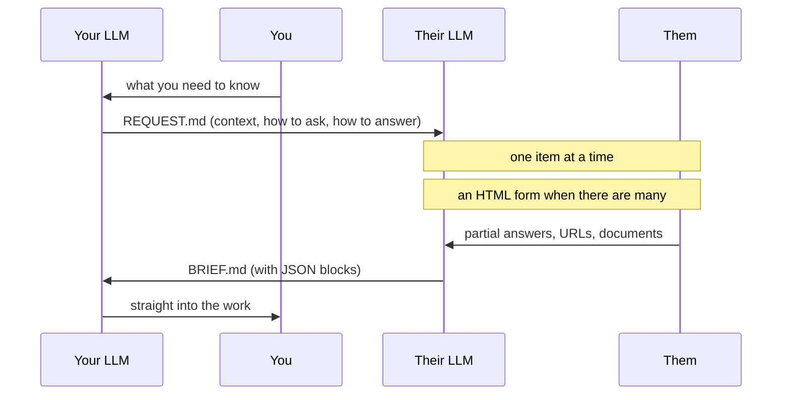

# AI Handoff

[日本語](README.md) ／ **English**

**Stop sending questionnaires to people. Send your counterpart's AI the way to ask instead.**

You write one Markdown file addressed not to the person you need information from, but to
**the LLM they already use**. Their LLM interviews them conversationally and writes back a
structured Markdown file you can use directly.



## Why this shape

Right now, both ends of a conversation have an LLM — and a human carries the text between them.

```
me → ask my LLM → write a message → send
                              → they receive → ask their LLM → write a message → send → …
```

Copying text out of a chat app and pasting it into an LLM is the moment this stops being
AI-native. **Only the carrying is left for the human.**

"Just connect the agents over an API" is not the answer either. **Each LLM holds things that
should stay where they are.**

| | |
|---|---|
| **Stays in each environment** | Secrets (tokens, keys, customer data) · company knowledge, past threads, internal rules · the Skills / MCP servers / tools that person installed |
| **Wasted today** | Context is not shared · round trips multiply · a human copies and pastes |

So **exactly one file crosses the boundary.** Environments never mix.

## Why a file

Because it needs no server, no auth, and **works no matter which LLM the other side uses.**

A more automated form — hand over a URL and be done — is possible in principle. But in 2026 the
assumption that *"the other person will add an arbitrary connector to their own LLM"* still does
not hold. Consumer apps that support it are limited.

**One file is the only shape that does not need that assumption.** It is not a degraded version;
it is the one with the fewest preconditions.

## Both files are written in English

The reader is an LLM, not a person. The same content in Japanese costs roughly
**1.5-2x the tokens**, and that repeats on every round trip.

Making the *conversation* English too would defeat the point, so **the spoken language
is declared in front matter.**

```yaml
---
protocol: ai-handoff/1
lang: ja
from: kazuma-horiike (KANKETSU Inc.)
people:
  - id: r-tanaka
    to: primary
    role: decision-maker
    tech: non-eng
    knows: html,css
    gap: next.js,headless-cms
    terms: explain-1line-on-first-use
---
```

`lang` is **the language to speak to the human in**. The document stays English; only the
conversation switches. **Quotes of what the person said, and proper nouns, stay in the original
language** -- translating them destroys their value as evidence.

## Nothing about a person goes in the body

Write "this person is a non-engineer who..." in the body and **the person it describes will read it**.
The file stays on their machine; it reads as an assessment, whatever you meant by it.

So anything about a person goes in `people`, in a **short machine-readable form**.
The LLM reads `gap` to decide how much to explain, and `decides` / `defers` to separate out
**what this person cannot settle alone** from the start.

🚨 **The LLM never reads that block out loud.** It only picks vocabulary and depth from it.
Writing it short does not make it hidden -- **writing something that is fine to read** is the real rule.

`people` is a list, so **a request can address several people.** If the LLM's owner is a `cc`,
it returns the items only the `primary` can settle in a separate section of `BRIEF.md`.

## The mechanism is never prescribed

Even within Claude, running in a terminal, a desktop app or a phone changes
**whether you can write a file at all, and whether you can connect to external tools.**

So `REQUEST.md` states **only the goal**, and **the receiving LLM picks the means** --
printing the brief into chat if it cannot write a file, and so on.

🚨 **Whatever fallback it picked, and why, goes at the top of `BRIEF.md`.**
A silent substitution creates a round trip to find out why the result looks unexpected,
which is exactly what this protocol exists to remove.

## Ask for material, not just answers

Asking "is X correct?" makes the person recall, look up, and summarize. Most of that work
disappears if they can hand over something that already exists.

So every question carries this:

> If you have a file, a link, or a screenshot about this, just send it as-is.
> I will read it and tell you where it differs from what we have.

**Never ask them to summarize.** Reading is the LLM's job. Screenshots, pasted chat logs,
outdated documents -- take all of it. "Too messy to send" is the worst outcome.

🚨 **And do not stop at receiving it.** `BRIEF.md` records **what arrived** and
**how it differs from our values.** Without the diff, the requester redoes the same reading
and nothing was saved.

## Interview the requester before writing

**Before writing a line of `REQUEST.md`, question the requester.**
Skip it and you produce a file with **the requester's own assumptions missing from it** --
and you find out which ones only after the answers come back.

The questionnaire is [`templates/PREFLIGHT.md`](templates/PREFLIGHT.md). **It is never handed
over** -- use it locally, fold the answers into `REQUEST.md`, discard it.

Two of its questions carry most of the value.

- **What is already settled** (must not be re-asked)
- **What they already have** (minutes, past messages, drafts)

🚨 Written without those two, the file asks a person to re-answer their own meeting.

## Short questions. Depth on request

**No three paragraphs of background before the question.** They came to answer, not to read
a briefing.

```
❌ context, context, context → finally, a question
✅ one question + the one or two lines that bear on it → "say the word for detail"
```

Context goes **in the file, thick**. It does **not** go into the conversation. The LLM holds
all of it and spends only what this question needs.

And it offers depth once, at the start:

> I can explain the reasoning behind any of this --
> **just say "tell me more" and I will go deeper.**

Unoffered, a short question reads as a shallow topic and people answer by guessing.

## Nobody is told what this is NOT

Corrections in `REQUEST.md` are addressed to **their LLM**, not to the person.

Write "this is not A, it is B" and the LLM says exactly that, out loud. The person then
wonders **why they are being contradicted** -- and the denial is a fact about your wording
history, not about their work.

```
❌ "This is not a campaign. What we are building is…"
✅ "What we are building is ⟨X⟩, and it is permanent"
```

**Let the LLM hold the understanding and never voice it.**

## Usage

### If you are asking

1. Copy [`templates/REQUEST.md`](templates/REQUEST.md) and fill it in
2. Send the file itself and say: *"Give this to your LLM and tell it to start asking."*
3. Read the returned `BRIEF.md` with your own LLM

### If you are the LLM being asked

Instructions for you are at the top of `REQUEST.md`. **Read all of it before asking anything,
then go one item at a time.** Details in [`SPEC.en.md`](SPEC.en.md).

## Spec

- [`SPEC.en.md`](SPEC.en.md) — the rules (what makes a `BRIEF.md` valid)
- [`templates/REQUEST.md`](templates/REQUEST.md) — what the requester writes
- [`templates/BRIEF.md`](templates/BRIEF.md) — what their LLM returns

## License

MIT. **You are welcome to read this repository and have your LLM write a `REQUEST.md` addressed
to me.** It works the same way in both directions.
