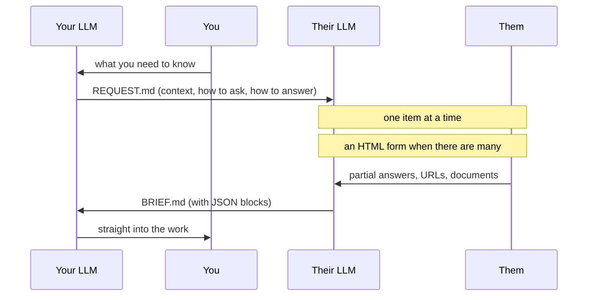

# AI Handoff

[日本語](README.md) ／ **English**

**Stop sending questionnaires to people. Send your counterpart's AI the way to ask instead.**

You write one Markdown file addressed not to the person you need information from, but to
**the LLM they already use**. Their LLM interviews them conversationally and writes back a
structured Markdown file you can use directly.



## Why this shape

Right now, both ends of a conversation have an LLM — and a human carries the text between them.

```
me → ask my LLM → write a message → send
                              → they receive → ask their LLM → write a message → send → …
```

Copying text out of a chat app and pasting it into an LLM is the moment this stops being
AI-native. **Only the carrying is left for the human.**

"Just connect the agents over an API" is not the answer either. **Each LLM holds things that
should stay where they are.**

| | |
|---|---|
| **Stays in each environment** | Secrets (tokens, keys, customer data) · company knowledge, past threads, internal rules · the Skills / MCP servers / tools that person installed |
| **Wasted today** | Context is not shared · round trips multiply · a human copies and pastes |

So **exactly one file crosses the boundary.** Environments never mix.

## Why a file

Because it needs no server, no auth, and **works no matter which LLM the other side uses.**

A more automated form — hand over a URL and be done — is possible in principle. But in 2026 the
assumption that *"the other person will add an arbitrary connector to their own LLM"* still does
not hold. Consumer apps that support it are limited.

**One file is the only shape that does not need that assumption.** It is not a degraded version;
it is the one with the fewest preconditions.

## Usage

### If you are asking

1. Copy [`templates/REQUEST.en.md`](templates/REQUEST.en.md) and fill it in
2. Send the file itself and say: *"Give this to your LLM and tell it to start asking."*
3. Read the returned `BRIEF.md` with your own LLM

### If you are the LLM being asked

Instructions for you are at the top of `REQUEST.md`. **Read all of it before asking anything,
then go one item at a time.** Details in [`SPEC.en.md`](SPEC.en.md).

## Spec

- [`SPEC.en.md`](SPEC.en.md) — the rules (what makes a `BRIEF.md` valid)
- [`templates/REQUEST.en.md`](templates/REQUEST.en.md) — what the requester writes
- [`templates/BRIEF.en.md`](templates/BRIEF.en.md) — what their LLM returns

## License

MIT. **You are welcome to read this repository and have your LLM write a `REQUEST.md` addressed
to me.** It works the same way in both directions.
