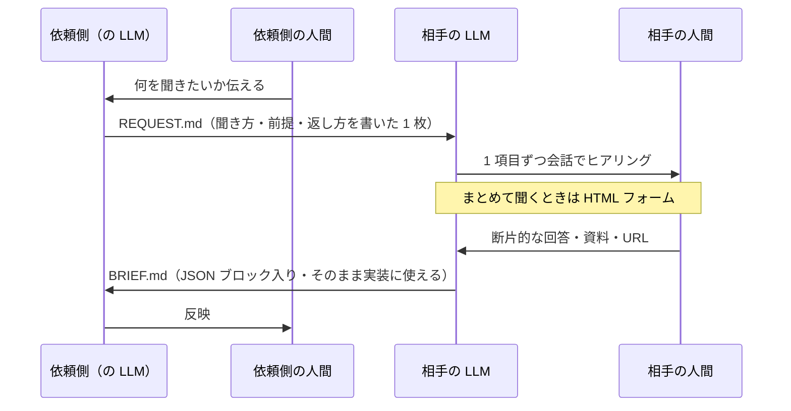

# AI Handoff

**日本語** ／ [English](README.en.md)　·　記事: https://zenn.dev/kazuma_horiike/articles/262a68d6c08054

**人に質問表を送るのをやめて、相手の AI に「聞き方」を送るプロトコルです。**

依頼する側は、相手の担当者ではなく **相手が使っている LLM 宛てに 1 枚の Markdown を書きます**。
相手の LLM がその場で会話しながらヒアリングし、こちらがそのまま使える構造化された
Markdown を書き戻します。人間は、自分が普段使っている AI と喋るだけで済みます。



## なぜこの形なのか

**LLM が両端にいるのに、真ん中で人間が文章を運んでいます。**

```
私 → 自分の LLM に相談 → 文章を作る → 送る
                                → 相手が受け取る → 相手の LLM に相談 → 文章を作る → 送る → …
```

これは過渡期の形です。LLM がこれからさらに便利になり、誰もが日常的に使うようになるほど、
**この真ん中の運搬が無駄になっていきます。** LINE の文字を人がコピーして LLM に貼り直す。
その時点で、もう AI ネイティブではありません。

ただし「API で直結すればいい」でもありません。**いまの形には捨ててはいけない利点があります。**

```
🟢 越境させないもの（各自の環境に留まる）
   秘密情報・会社固有の知識・過去のやり取り・その人が入れた Skill / MCP
🚨 いま無駄になっているもの
   文脈が共通化されない ／ 往復が増える ／ 人がコピペで運んでいる
```

だから**ファイルを 1 枚渡す**形にしています。**越境するのはファイルだけ**で、環境は混ざりません。
そのうえで、文脈をファイルに明示的に載せて、往復とコピペを減らします。

- 人間は**まとめて 20 問**を受け取らない。1 項目ずつ会話で進む
- 「一旦ここまで」で**途中の BRIEF.md** を返せる。全部埋まるまで待たない
- 返ってくるのは散文ではなく **JSON ブロック入りの Markdown**。そのままコードに使える
- 分からないことは **`未確認` と明示**される。埋められた推測が混ざらない

## なぜ「ファイル」なのか

サーバーも認証もいらず、**相手が何の LLM を使っていても成立する**からです。

もっと仕組み化した形（部屋を作って URL を渡すだけで済む形）も考えていますが、
2026 年時点では **「相手が自分の LLM に任意の接続先を追加してくれる」という前提が
まだ成立しません。** 消費者向けアプリでそれが素直にできるものは限られています。

**ファイル 1 枚は、その前提を必要としない唯一の形です。** 劣化版ではなく、
前提条件がいちばん少ない形として選んでいます。

## 使い方

### 依頼する側

1. [`templates/REQUEST.md`](templates/REQUEST.md) をコピーして中身を埋める
2. 相手に**ファイルごと**渡し、「これを Claude（などの LLM）に渡して『このMDを見て質問を始めて』と言ってください」と伝える
3. 返ってきた `BRIEF.md` を自分の LLM に読ませる

### 聞かれる側（の LLM）

`REQUEST.md` の冒頭に、あなた（LLM）への指示が書いてあります。**先に全部読んでから、
1 項目ずつ会話を始めてください。** 詳細は [`SPEC.md`](SPEC.md) にあります。

## 仕様

- [`SPEC.md`](SPEC.md) — プロトコルの規則（何を守れば `BRIEF.md` として通用するか）／ [English](SPEC.en.md)
- [`templates/REQUEST.md`](templates/REQUEST.md) — 依頼側が書く雛形
- [`templates/BRIEF.md`](templates/BRIEF.md) — 相手の LLM が返す雛形

## ライセンス

MIT。**このリポジトリを読んで、あなたの LLM が私宛の `REQUEST.md` を書いても構いません。**
逆方向にも同じように使えます。
