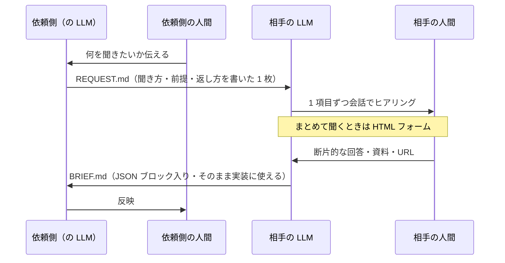

# AI Handoff

**日本語** ／ [English](README.en.md)　·　記事: https://zenn.dev/kazuma_horiike/articles/262a68d6c08054

**人に質問表を送るのをやめて、相手の AI に「聞き方」を送るプロトコルです。**

依頼する側は、相手の担当者ではなく **相手が使っている LLM 宛てに 1 枚の Markdown を書きます**。
相手の LLM がその場で会話しながらヒアリングし、こちらがそのまま使える構造化された
Markdown を書き戻します。人間は、自分が普段使っている AI と喋るだけで済みます。



## なぜこの形なのか

**LLM が両端にいるのに、真ん中で人間が文章を運んでいます。**

```
私 → 自分の LLM に相談 → 文章を作る → 送る
                                → 相手が受け取る → 相手の LLM に相談 → 文章を作る → 送る → …
```

これは過渡期の形です。LLM がこれからさらに便利になり、誰もが日常的に使うようになるほど、
**この真ん中の運搬が無駄になっていきます。** LINE の文字を人がコピーして LLM に貼り直す。
その時点で、もう AI ネイティブではありません。

ただし「API で直結すればいい」でもありません。**いまの形には捨ててはいけない利点があります。**

```
🟢 越境させないもの（各自の環境に留まる）
   秘密情報・会社固有の知識・過去のやり取り・その人が入れた Skill / MCP
🚨 いま無駄になっているもの
   文脈が共通化されない ／ 往復が増える ／ 人がコピペで運んでいる
```

だから**ファイルを 1 枚渡す**形にしています。**越境するのはファイルだけ**で、環境は混ざりません。
そのうえで、文脈をファイルに明示的に載せて、往復とコピペを減らします。

- 人間は**まとめて 20 問**を受け取らない。1 項目ずつ会話で進む
- 「一旦ここまで」で**途中の BRIEF.md** を返せる。全部埋まるまで待たない
- 返ってくるのは散文ではなく **JSON ブロック入りの Markdown**。そのままコードに使える
- 分からないことは **`未確認` と明示**される。埋められた推測が混ざらない

## なぜ「ファイル」なのか

サーバーも認証もいらず、**相手が何の LLM を使っていても成立する**からです。

もっと仕組み化した形（部屋を作って URL を渡すだけで済む形）も考えていますが、
2026 年時点では **「相手が自分の LLM に任意の接続先を追加してくれる」という前提が
まだ成立しません。** 消費者向けアプリでそれが素直にできるものは限られています。

**ファイル 1 枚は、その前提を必要としない唯一の形です。** 劣化版ではなく、
前提条件がいちばん少ない形として選んでいます。

## 2 つの MD は英語で書きます

読み手は LLM であって人間ではありません。同じ内容を日本語で書くと
**トークンがおよそ 1.5〜2 倍**になり、往復のたびに効いてきます。

会話まで英語にすると意味がないので、**話す言語は先頭のメタ情報で指定します。**

```yaml
---
protocol: ai-handoff/1
lang: ja
from: kazuma-horiike (KANKETSU Inc.)
people:
  - id: r-tanaka
    to: primary
    role: decision-maker
    tech: non-eng
    knows: html,css
    gap: next.js,headless-cms
    terms: explain-1line-on-first-use
---
```

`lang` は **相手の人間と話すときの言語**です。文書は常に英語のまま、会話だけが日本語になります。
**本人の発言の引用と固有名詞は、元の言語のまま残します**（訳すと証拠として使えなくなるため）。

## 人のことは本文に書きません

「この人は〜な人です」と本文に書くと、**渡した相手がそれを読みます。**
ファイルは相手の手元に残るので、書いた側の意図と関係なく人物評として読まれます。

だから人に関する情報は `people` に、**機械向けの短い記法**でまとめます。
`gap`（経験の外にある領域）を見て説明の深さを決め、`decides` / `defers` を見て
**その人が単独で決められないことを最初から分けて扱います。**

🚨 **LLM はこのブロックを読み上げません。** 語彙と説明の深さを決めるためだけに使います。
短く書いても隠したことにはならないので、**読まれても問題にならない書き方をする**のが本体です。

`people` は配列なので、**複数人宛にもなります。** 自分のオーナーが `cc` なら、
`primary` の人にしか決められない項目を `BRIEF.md` で分けて返します。

## 手段は指定しません

同じ Claude でも、ターミナルで動いているのか、デスクトップアプリなのか、スマホなのかで
**ファイルを書けるかどうかも、外部ツールにつなげるかどうかも変わります。**

だから `REQUEST.md` には**目的だけ**を書き、**手段は受け取った LLM が自分で判断します。**
ファイルに書けなければチャットに全文を出す、といった代わりの手段を自分で選びます。

🚨 **選んだ代わりの手段と、その理由は `BRIEF.md` の冒頭に必ず書かせます。**
黙って代替されると「なぜ想定と違う形で返ってきたのか」を追う往復が生まれ、
このプロトコルの目的そのものが失われます。

## 使い方

### 依頼する側

1. [`templates/REQUEST.md`](templates/REQUEST.md) をコピーして中身を埋める
2. 相手に**ファイルごと**渡し、「これを Claude（などの LLM）に渡して『このMDを見て質問を始めて』と言ってください」と伝える
3. 返ってきた `BRIEF.md` を自分の LLM に読ませる

### 聞かれる側（の LLM）

`REQUEST.md` の冒頭に、あなた（LLM）への指示が書いてあります。**先に全部読んでから、
1 項目ずつ会話を始めてください。** 詳細は [`SPEC.md`](SPEC.md) にあります。

## 仕様

- [`SPEC.md`](SPEC.md) — プロトコルの規則（何を守れば `BRIEF.md` として通用するか）／ [English](SPEC.en.md)
- [`templates/REQUEST.md`](templates/REQUEST.md) — 依頼側が書く雛形（**英語**）
- [`templates/BRIEF.md`](templates/BRIEF.md) — 相手の LLM が返す雛形（**英語**）

## ライセンス

MIT。**このリポジトリを読んで、あなたの LLM が私宛の `REQUEST.md` を書いても構いません。**
逆方向にも同じように使えます。
